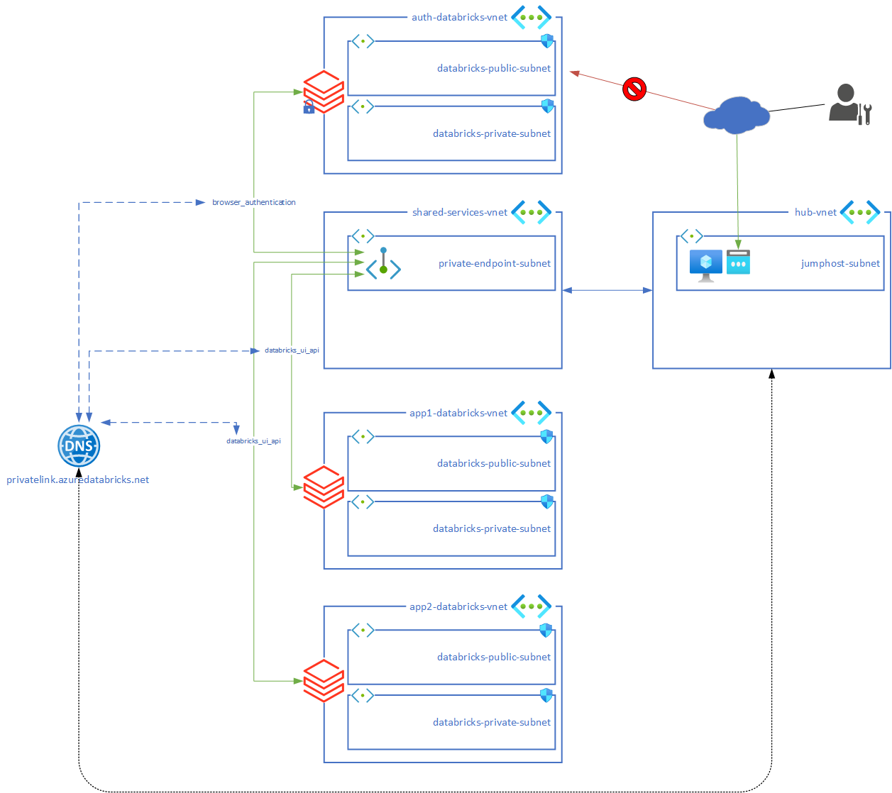
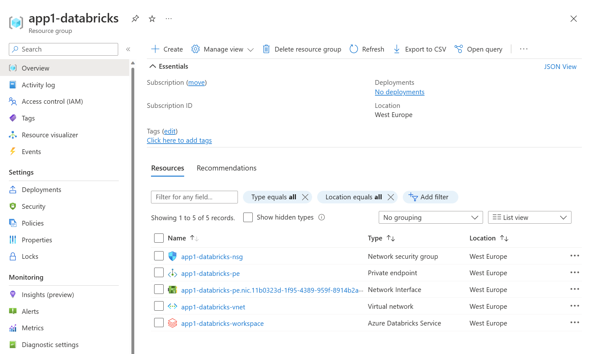

# Azure Databricks secure cluster deployment

## Overview
Terraform scripts to deploy multiple Azure Databricks workspaces using [secure cluster connectivity](https://learn.microsoft.com/en-us/azure/databricks/security/secure-cluster-connectivity).

# High Level Design


# Implementation
main.tf file generate the basic infrastructure (hub-vnet / shared-services-vnet / jumphost / private DNS zone ...) in a ressource group named shared-services.

Azure Databricks is managed by the module adb-private. This module will create a dedicated ressource group with the cluster ressources. 
````
module "databricks-1" {
    source = "./modules/adb-private"

    prefix = "app1"
    virtual_network_address_space = "10.0.0.0/23"
    subnet_public_address_prefixes = "10.0.0.0/24"
    subnet_private_address_prefixes = "10.0.1.0/24"
    subnet_private_private_endpoint_id = azurerm_subnet.subnet_private_endpoint.id
    private_dns_zone_id = azurerm_private_dns_zone.private_dns_zone_azuredatabricks.id
    private_endpoint_databricks_ui_api = true
    private_endpoint_browser_authentication = false
}
````


You have the capability to create a [Databricks workspace dedicated to the authentification](https://learn.microsoft.com/en-us/azure/databricks/administration-guide/cloud-configurations/azure/private-link#--step-4-configure-dns-to-support-sso-authentication-flow-required-for-ui-access) using this configuration : 
````
module "databricks-auth" {
    source = "./modules/adb-private"

    prefix = "private-web-auth"
    virtual_network_address_space = "10.0.4.0/23"
    subnet_public_address_prefixes = "10.0.4.0/24"
    subnet_private_address_prefixes = "10.0.5.0/24"
    subnet_private_private_endpoint_id = azurerm_subnet.subnet_private_endpoint.id
    private_dns_zone_id = azurerm_private_dns_zone.private_dns_zone_azuredatabricks.id
    private_endpoint_databricks_ui_api = false
    private_endpoint_browser_authentication = true
    databricks_workspace_lock = true
}
````

## Requirements
You will need to install : 
* [Terraform](https://www.terraform.io/downloads.html) (tested with version v1.3.6)
* Terraform Provider (installed using command *terraform init*): 
  * azurerm (tested with version v3.37.0)

## Quickstart
````
> terraform init
> terraform plan
> terraform apply
````
After less than 10 minutes all the infrastructure must be up and running and you can RDP to the jumphost using user / password provided by Terraform output. 

# Useful links
- https://learn.microsoft.com/en-us/azure/databricks/security/secure-cluster-connectivity

- https://learn.microsoft.com/en-us/azure/databricks/administration-guide/cloud-configurations/azure/private-link#--step-4-configure-dns-to-support-sso-authentication-flow-required-for-ui-access

